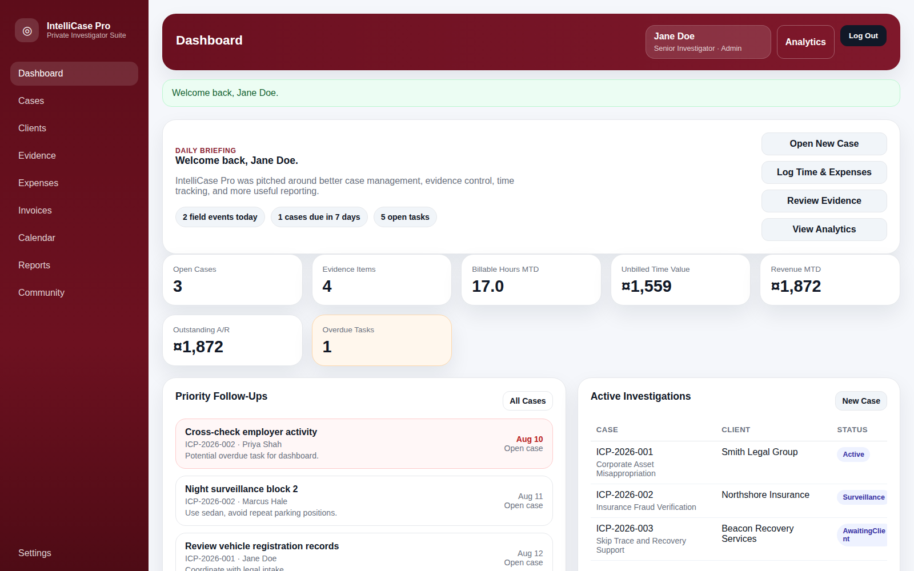
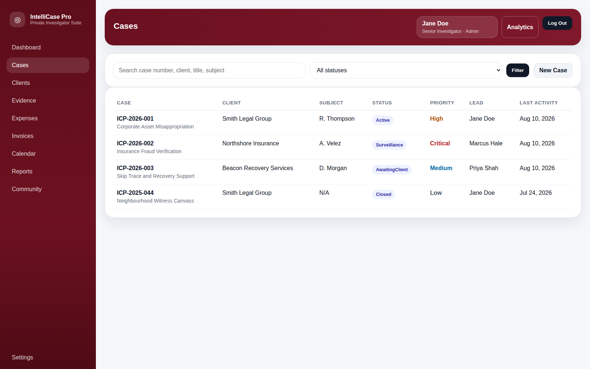
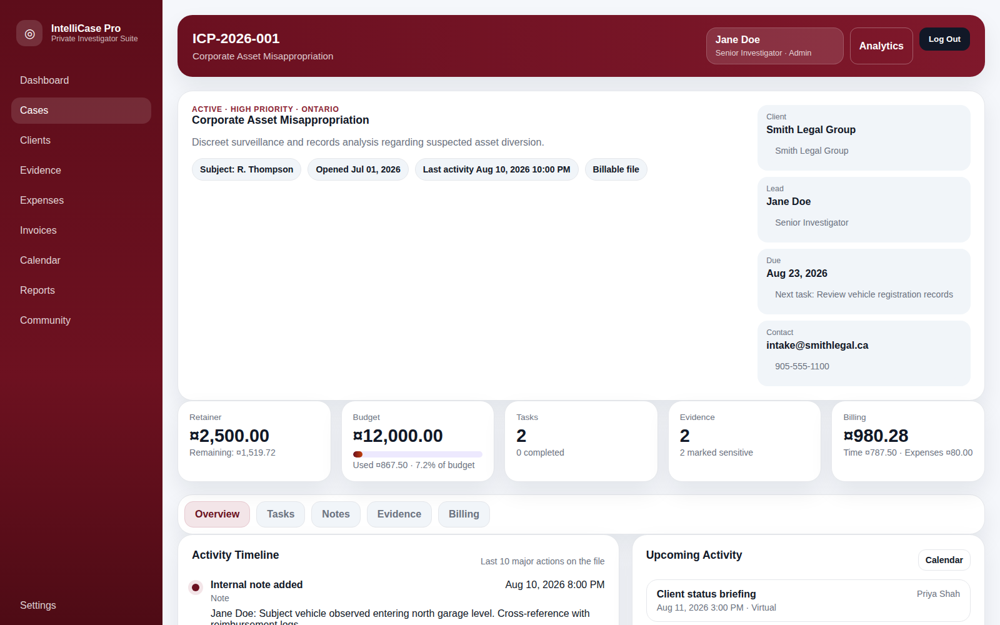
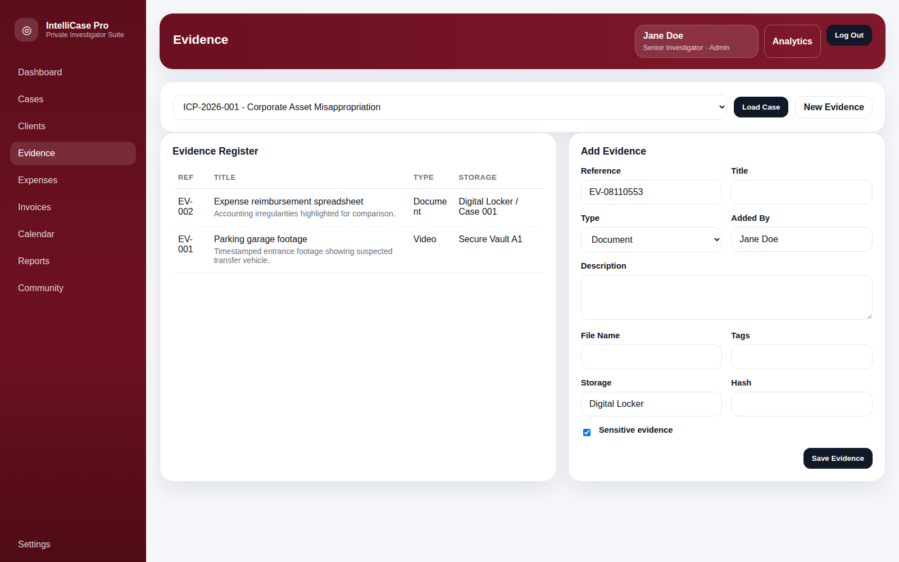

# IntelliCase Pro

**Full-stack investigative case management for web and Android.**

IntelliCase Pro is a portfolio-scale case management platform built around the operational needs of investigative teams. The web application brings case intake, evidence, time and expenses, billing, scheduling, reporting, and role-aware access into one workflow, while the native Android prototype explores how the same product can support mobile case review and field work.

The project combines an **ASP.NET Core 8 MVC / EF Core / SQLite** web stack with a separate **Kotlin + Jetpack Compose** Android application.

## Screenshots



**Dashboard** — daily briefing, case metrics, follow-ups, active investigations, workload, and operational visibility.



**Cases** — searchable case list with client, subject, status, priority, investigator, and recent activity.



**Case details** — a connected case workspace for investigation details, tasks, notes, evidence, time, and expenses.



**Evidence** — case-linked evidence intake and register for investigative records.

## Product at a glance

| Area | Implementation |
| --- | --- |
| Web application | ASP.NET Core 8 MVC + Razor Views |
| Data layer | Entity Framework Core + SQLite |
| Authentication | Cookie authentication + PBKDF2 password hashing |
| Mobile | Native Kotlin + Jetpack Compose Android app |
| Delivery | Docker, Docker Compose, GitHub Actions |
| Demo data | Seeded investigators, clients, cases, evidence, time, expenses, invoices, tasks, and calendar events |

## Investigative workflow

```text
Client / Case Intake
        ↓
Case Assignment + Tasks
        ↓
Evidence + Notes + Field Activity
        ↓
Time + Expense Tracking
        ↓
Invoices + Operational Reporting
        ↓
Dashboard / Follow-up / Case Review
```

The goal is to keep the operational pieces of an investigation connected instead of scattering case information across unrelated spreadsheets, notes, calendars, billing tools, and evidence logs.

## What the web app includes

### Case management

- Create and review investigative case files
- Track case number, title, status, priority, subject, jurisdiction, dates, budget, retainer, and billing state
- Assign lead investigators
- Maintain case-specific tasks and notes
- Search and review active investigations from the case list and dashboard

### Evidence and field operations

- Evidence register with quick intake
- Evidence records linked to cases
- Chain-of-custody data model support
- Calendar for surveillance, interviews, deadlines, and field activity
- Dashboard follow-ups for open and overdue tasks
- Investigator workload and upcoming field-activity views

### Time, expenses, and billing

- Billable time tracking
- Expense entry and categorization
- Per-case financial context
- Invoice overview
- Dashboard metrics for billable hours, unbilled time value, monthly revenue, and outstanding receivables

### Reporting and operations

- Case-status distribution
- Investigator workload visibility
- Revenue and closure reporting
- Dashboard KPIs and operational summaries
- Selected JSON API endpoints for cases, expenses, and reports

### Authentication and access

The web application uses cookie-based authentication with PBKDF2 password hashing. Demo users represent different investigative roles, and the **Settings** area is restricted to the admin role.

## Web architecture

```text
Browser
   ↓
ASP.NET Core MVC + Razor Views
   ↓
Controllers / Services
   ↓
Entity Framework Core
   ↓
SQLite
```

The repository separates UI, workflow/controller logic, reporting/dashboard services, persistence, security, and domain models so the application can grow without turning every feature into one heroic controller file fighting for its life.

## Native Android app

IntelliCase Pro also includes a real Android Studio project built with **Kotlin, Jetpack Compose, and Material 3**. It is not a WebView wrapper.

The current Android prototype includes:

- Native login
- Dashboard metrics and active-case cards
- Case review
- Evidence register
- Calendar
- Billing view
- Reports view
- Local demo data based on the web product

The Android app currently runs as a local prototype. Connecting it to the ASP.NET Core APIs and adding offline synchronization are future integration steps.

### Download the Android demo

[**Download IntelliCasePro-Android-demo.apk**](https://github.com/Kyla-Zeit/intellicase-pro/raw/main/downloads/IntelliCasePro-Android-demo.apk)

The included APK is debug-signed for portfolio/demo review and is not intended for Play Store distribution.

## Demo login

The web build seeds three demo investigator accounts:

| Role | Email | Password |
| --- | --- | --- |
| Admin | `jane@intellicasepro.local` | `Demo#2026!` |
| Investigator | `marcus@intellicasepro.local` | `Demo#2026!` |
| Analyst | `priya@intellicasepro.local` | `Demo#2026!` |

The Android prototype accepts:

```text
jane@intellicasepro.local
Demo#2026!
```

These credentials are intentionally public demo credentials for the seeded local application.

## Run the web app locally

### Requirements

- .NET 8 SDK
- Visual Studio, VS Code, or another .NET-capable editor

### Start with .NET

```bash
dotnet restore ./src/IntelliCasePro.Web/IntelliCasePro.Web.csproj
dotnet run --project ./src/IntelliCasePro.Web/IntelliCasePro.Web.csproj
```

Open the local URL shown in the terminal.

## Run with Docker

The repository includes a Dockerfile and Docker Compose configuration for a one-command local environment.

```bash
docker compose up --build
```

Then open:

```text
http://localhost:8080
```

SQLite data is persisted through the mounted local `./data` directory so seeded data and changes survive container restarts.

## CI

GitHub Actions runs automatically on pushes and pull requests to `main`.

The workflow currently:

```text
Checkout
   ↓
Set up .NET 8
   ↓
Restore
   ↓
Release build
```

Workflow: `.github/workflows/dotnet-build.yml`

## Project structure

```text
.github/
  workflows/

src/
  IntelliCasePro.Web/
    Controllers/
      Api/
    Data/
    Models/
    Security/
    Services/
    Views/
    wwwroot/

android/
  app/
  gradle/

docs/
downloads/

Dockerfile
docker-compose.yml
```

## Core domain model

The web application models the main records required to represent an investigative workflow, including:

- Clients
- Investigators
- Cases
- Case tasks
- Case notes
- Evidence items
- Chain-of-custody entries
- Time entries
- Expense entries
- Calendar events
- Invoices

## Tech

**Web:** C# · ASP.NET Core 8 MVC · Razor Views · HTML · CSS  
**Data:** Entity Framework Core · SQLite  
**Security:** Cookie authentication · PBKDF2 password hashing · role-aware access  
**Mobile:** Kotlin · Jetpack Compose · Material 3 · Gradle  
**Delivery:** Docker · Docker Compose · GitHub Actions

## Current scope

IntelliCase Pro is a portfolio project demonstrating full-stack application design around a real operational domain. The web application is the primary connected system. The Android build is a native prototype using local demo data rather than pretending to have backend synchronization that has not been implemented yet.

## Roadmap

Practical next steps include:

- Full user and permission management
- Complete chain-of-custody workflow UI and audit history
- Secure evidence/document storage
- Invoice generation and PDF export
- Android-to-API integration
- Offline-first mobile field capture and synchronization
- Multi-tenant agency support
- External mapping, communications, legal-research, and forensic-tool integrations

Additional deployment and roadmap notes are available in [`docs/`](docs/).
